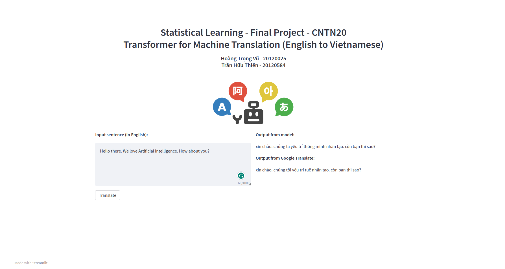

# English-Vietnamese Translation using Transformer

This is our Final Project for the Statistical Learning Course at VNUHCM - University of Science.

## 1. Installation
<span id='install'></span>

You should have CUDA installed with version >= 11.1.

Installation commands:

```bash
conda create -n trans python=3.9
conda activate trans
bash install.sh
```

## 2. Demo Application
<span id='demo'></span>

Download the trained weights at this [link](https://drive.google.com/file/d/1aET3EOANvxIsMUjhKKt0ZTxSqpaOo58a/view?usp=sharing) and put it in folder `./runs`.

Expected structure:

```
./runs/
    |-- <folder_name>/
        |-- config.yaml
        |-- best.pt
        |-- src_field.pt
        |-- trg_field.pt
        |-- ...
```

Run:

```bash
streamlit run app.py ./runs/<folder_names>
```

Screenshots:

<p align="center">
    
</p>


## 3. Dataset
<span id='dataset'></span>

We use the dataset from TED Talk (provided at [this](https://github.com/pbcquoc/transformer#dataset) repo by [pbcquoc](https://github.com/pbcquoc)). You can download the dataset at [this](https://drive.google.com/file/d/1y9udEJSwe9eqPSSSt79GImD3Ai-o9nV4/view?usp=sharing) link and put it in folder `./data`.

Expected structure:

```
./data/
    |-- train.en
    |-- train.vi
    |-- val.en
    |-- val.vi
    |-- test.en
    |-- test.vi
```

## 4. Training
<span id='train'></span>

You can modify the model architecture, optimizer hyps,... at the config file `./configs/_base_.yaml`. Then run the command:

```bash
python ./tools/train.py \
    --config_path ./configs/_base_.yaml \
    --device cuda:0
```

## 5. Evaluation
<span id='eval'></span>

With the result folder you get from training process, you can use it to evaluate the model with these command:

```bash
python -u tools/eval.py \
    --runs_path ./runs/2023-06-28_16-57-19 \
    --beam-size 3 \
    --device cuda:0
```

You can also add the argument `--run-train-set` to evaluate on set training, but it will take a long time to complete.